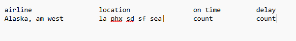

## 5A: Introduction

For this assignment, we are tasked with using a slightly disheveled set of airline data, cleaning it up, and analyzing it to generate some meaningful talking points. This serves as an exercise in tidying datasets as well as using self-driven analytical terms to draw conclusions, not relying too much on a strict goal but rather a means to let us create.

From looking at the CSV, my thought process for approaching this was to get everything pivoted so that the different locations were not the columns. As we will see in my code walk through I also had to use some clever de-pivoting in order to get the data to look the way I wanted it to for data analysis.

## The Code

To start for this assignment, I generated my own "Flight_Data.csv" by manually inputting the values into google sheets, and saving it as a .CSV. For my own creative process, I also loosely mapped how I wanted the data to look when I was done tidying it. See below.



```{r}
library(tidyverse)
```

First I had to Load in my newly generated .csv file.

```{r}

Flights_Raw <- read.csv("Flight_Data.csv")

Flights_Raw
```

My goal from this point was to get the data into a longer format, and to generally clean it up. there is a missing row of data, and some inconsistent data formatting. To bypass this, I looked to drop NA's and manually fill missing rows. Once I got that all squared away, I was good to pivot the different airport locations into rows rather than columns.

```{r}

Flights_1 <- Flights_Raw |>
  rename(
    "Airline" = X,
    "Plane_Arrival" = X.1
  )  |>
  drop_na() |>
  mutate(
    Airline = case_when(
      row_number() == 2 ~ "ALASKA",
      row_number() == 4 ~ "AM WEST",
      .default = Airline
    )) |>
  pivot_longer(!Airline:Plane_Arrival, names_to = "Location", values_to = "Count")
  
Flights_1
```

This format of data was easy to then manipulate into an analysis of the total on time and delayed ratios, which I then characterized as "Percent Reliability". I figured it's best to look at the sum before breaking it down into smaller parts for this analysis. I used some grouping and summarizing, followed by a mutated column to get my new reliability value.

```{r}
Airline_Reliability <- Flights_1 |>
  group_by(Airline) |>
  summarize(
    On_Time_Count = sum(Count[Plane_Arrival == "on time"]),
    Delayed_Count = sum(Count[Plane_Arrival == "delayed"])
  ) |>
  mutate( Total_Flights = On_Time_Count + Delayed_Count,
          Percent_Reliability = round(100*(On_Time_Count/(On_Time_Count + Delayed_Count)))) 

Airline_Reliability
```

As you can see here, the airlines compare pretty well in terms of reliabilty. "AM WEST" is slightly more reliable, simply based on frequency of flights compared to "ALASKA".

I wanted to dig a little deeper to get into the different reliabilities based on airport as well. I still broke out the airlines so that we can have a more rigorous analysis. Similar to my point above, the danger of our outputs here is that the data we get could be smaller sample sizes, which could then skew the reliability data.

To get this data in the right format, I had to take the previous pivoting function and manipulate it one step further to again widen it. My original approach was to try a transpose t() function, but I found through some errors and internet searching that this isn't the ideal approach. Claude suggested using pivot_wider() and I did so, which helped tremendously. I was able to continue the manipulation within this same pipeline and get to a final summarized look at flight reliability per location and airline.

```{r}
Location_Airline_Reliability <- Flights_Raw |>
  rename(
    "Airline" = X,
    "Plane_Arrival" = X.1
  )  |>
  drop_na() |>
  mutate(
    Airline = case_when(
      row_number() == 2 ~ "ALASKA",
      row_number() == 4 ~ "AM WEST",
      .default = Airline
    )) |>
  pivot_longer(!Airline:Plane_Arrival, names_to = "Location", values_to = "Count") |>
  pivot_wider(names_from = c(Airline, Plane_Arrival),
              values_from = Count) |>
  mutate(
    Alaska_Total_Flights = `ALASKA_on time` + `ALASKA_delayed`,
    Am_West_Total_Flights = `AM WEST_on time` + `AM WEST_delayed`,
    Alaska_Reliability = round(100*(`ALASKA_on time`/(`ALASKA_on time`+`ALASKA_delayed`))),
    Am_West_Reliability =round(100*(`AM WEST_on time`/(`AM WEST_on time`+`AM WEST_delayed`)))
  ) |>
  select(Location, Alaska_Total_Flights, Am_West_Total_Flights, Alaska_Reliability, Am_West_Reliability)

Location_Airline_Reliability
```

As I was discussing earlier, the difficult piece with this data is that you can't take it for face value without accounting for the volume of flights as well. as you can see, for Phoenix, we could say the airline companies are fairly similar in reliability, but Alaska has almost 5000 less flights under its belt.

To account for this, my final presentation of the data will include a rough "confidence interval" calculated using the largest number of flights of a single carrier, which for this is 5255.

```{r}
Location_Airline_Reliability |>
  mutate(
    Alaska_Confidence_Interval = round((Alaska_Total_Flights/5255), digits = 2),
    AmWest_Confidence_Interval = round((Am_West_Total_Flights/5255), digits = 2)
  )|>
  select(Location, Alaska_Reliability, Alaska_Confidence_Interval, Am_West_Reliability, AmWest_Confidence_Interval)

Airline_Reliability|>
  select(Airline, Percent_Reliability)
```

## Conclusion

As you can see from the 2 final tables above, the conclusions of this analysis are both simple and complex. If you look at the overall summaries, you can see that Alaska and Am West have similar percent reliabilities. When you dive in deeper, you see that sample size plays a big role in verifying these reliabilities. The largest sample of flights comes from Am West in Phoenix, and the next biggest sample is just under half of that. It is fascinating to see that one of the highest values of confidence is also one of the most reliable.

The big takeaway from this is that you can then use these values to make judgement calls on how reliable your flight will be, if that then affects your travel decision making or business planning. However, the fine print of using this data comes in the form of that confidence interval, so as long as you are comfortable with the reliability given the sample size of data than go for it! And all things considered, the odds are generally in your favor to be departing on time.
